# Options Pricing, Volatility Surface & Delta Hedging — SPY 2022


Projet de recherche quantitative sur les options **SPY** en 2022 : 1,15 million de cotations de fin de journée, 247 séances, une année baissière (−20 %) et volatile (vol réalisée 24,3 %). Tout le moteur (Black-Scholes, Greeks, Monte Carlo, inversion d'IV, Heston, couverture) est codé à partir des formules, sans librairie de pricing.

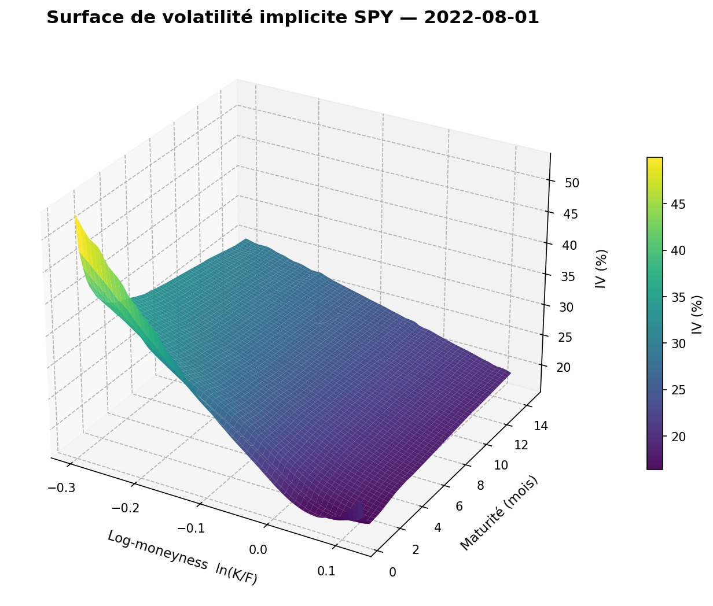

## Question de recherche

**Comment les hypothèses de volatilité affectent-elles le pricing des options et la performance du delta-hedging ?**

| # | Question | Réponse courte (détails dans les notebooks) |
|---|---|---|
| 1 | Black-Scholes reproduit-il les prix de marché ? | **Non.** L'IV varie de ~17 % à ~37 % selon le strike à 1 mois. Une vol unique se trompe de **5,8 pts** de vol en moyenne (RMSE). |
| 2 | Que nous apprend le smile ? | Un **skew** négatif (demande de protection, corrélation spot-vol) dont la pente décroît en **T^−0,3**. En stress, la structure par terme s'**inverse**. Le skew est le plus pentu en marché calme. |
| 3 | Heston reproduit-il mieux le marché ? | **Oui** : RMSE hors échantillon de **0,88 pt** (÷6,6 vs Black-Scholes) avec 5 paramètres. Heston reste insuffisant sur le skew court terme, et la condition de Feller est violée. |
| 4 | Quelle performance pour le delta-hedging ? | Erreur ∝ 1/√N conforme à la théorie. La **fréquence optimale** dépend des frais. La couverture delta laisse une exposition pure à **IV − vol réalisée** : en 2022, 10 short calls couverts sur 12 perdent, et le P&L est corrélé à **0,81** avec IV − RV. |

## Architecture

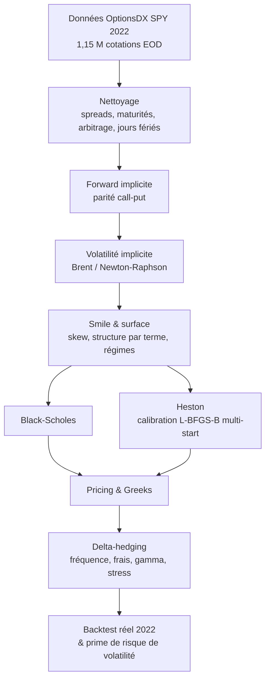

## Structure du repo

```
options-pricing-volatility/
├── README.md
├── requirements.txt
├── src/                          # moteur de calcul (importable)
│   ├── black_scholes.py          # prix BSM avec dividende continu
│   ├── greeks.py                 # delta, gamma, vega, theta, rho analytiques
│   ├── monte_carlo.py            # pricing MC + IC + benchmark BS
│   ├── market_data.py            # chargement OptionsDX (cache, parquet, jours fériés)
│   ├── data_cleaning.py          # filtres de qualité + tableau de contrôle
│   ├── implied_vol.py            # Brent, Newton-Raphson, bornes d'arbitrage, forward implicite
│   ├── diagnostics.py            # tableau de diagnostic qualité
│   ├── volatility_smile.py       # tracé du smile
│   ├── volatility_surface.py     # surface 3D, heatmap
│   ├── surface_tools.py          # interpolation à moneyness/maturité constante
│   ├── heston.py                 # simulation Euler tronquée, condition de Feller
│   ├── heston_pricing.py         # pricing semi-analytique (fonction caractéristique)
│   ├── calibration.py            # calibration Heston en IV + validation + graphiques
│   ├── hedging.py                # delta-hedging (boucle détaillée + version vectorisée)
│   ├── backtest.py               # backtest de couverture sur données réelles
│   ├── pipeline.py               # chaîne données -> IV partagée par les notebooks
│   └── plotting.py               # style graphique commun
├── notebooks/
│   ├── 01_black_scholes_greeks.ipynb
│   ├── 02_monte_carlo.ipynb
│   ├── 03_market_data_implied_vol.ipynb
│   ├── 04_volatility_smile_surface.ipynb
│   ├── 05_heston_calibration.ipynb
│   ├── 06_delta_hedging.ipynb
│   └── 07_volatility_risk_premium_regimes.ipynb
├── tests/                        # 396 tests pytest
├── figures/                      # 41 figures générées par les notebooks
├── results/                      # tableaux de résultats (CSV + Markdown)
├── data/README.md                # source et préparation des données (CSV non versionné)
├── scripts/                      # extraction des données, calibration par régime, ré-exécution des notebooks
└── docs/
    ├── MODIFICATIONS.md          # journal des corrections et ajouts
    └── INTERVIEW_NOTES.md        # questions d'entretien et réponses chiffrées
```

---

## Résultats

### Level 1 — Moteur de pricing (notebooks 01-02)

- Validation : call de référence de Hull retrouvé (10,4506). Parité call-put vérifiée à 1e-13 sur 10 000 tirages. Résidu de l'EDP de Black-Scholes < 3e-15. Greeks analytiques = différences finies (écarts de 1e-5 à 1e-12).
- Monte Carlo : convergence en **N^−0,489** (théorie −0,5) mesurée sur 200 graines. À 1 M de chemins, l'erreur est d'environ 0,01 $ sur une option à 10,45 $.

| Greeks vs spot pour 3 maturités | Erreur Monte Carlo vs N |
|---|---|
| 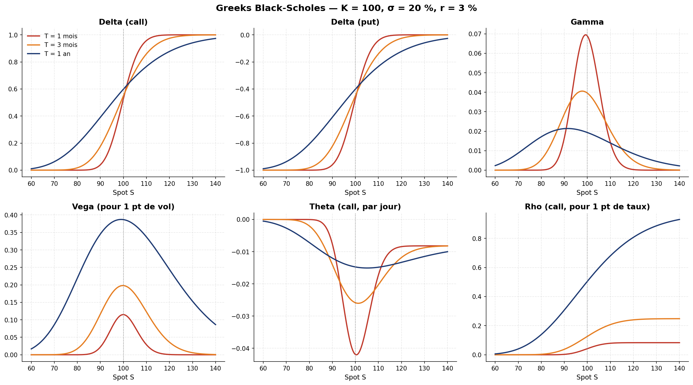 | 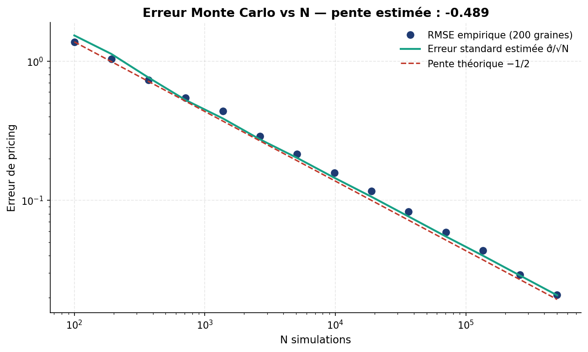 |

### Level 2 — Données de marché et volatilité implicite (notebooks 03-04)

**Nettoyage** (01/08/2022) : 9 236 → 8 427 cotations (−8,8 %). Taux de succès de l'IV : **97,9 %**. Environ 140 strikes par échéance et 32 échéances.

**Le forward compte autant que le modèle.** Avec un dividende fixe de 1,5 %, calls et puts de même strike ont des IV différentes de **1,6 pt** en médiane, ce qui est incohérent par parité. En extrayant le forward de la parité call-put ($F = K + e^{rT}(C-P)$), l'écart tombe à **0,01 pt**, et le détachement du dividende SPY de septembre apparaît dans la courbe de dividende implicite.

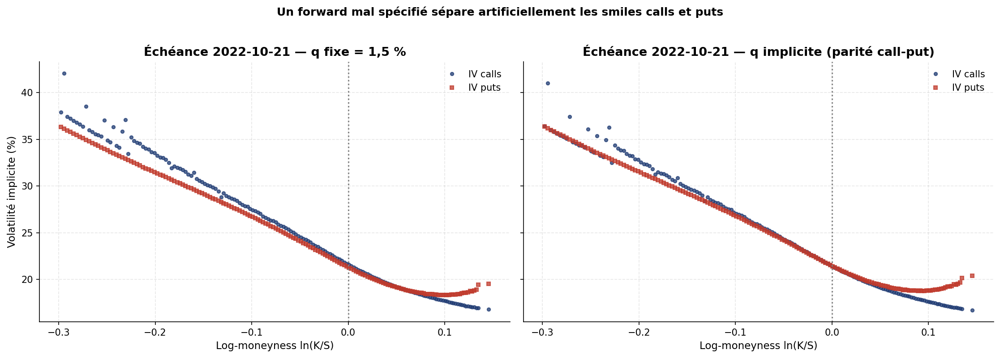

**Brent vs Newton-Raphson** sur 8 252 options réelles :

| Méthode | Succès | Itérations moyennes | Temps / option |
|---|---|---|---|
| Brent | **100 %** | 11,4 | 1,99 ms |
| Newton-Raphson (σ₀ = 20 %) | 81 % | 4,6 | 0,73 ms |

Newton échoue là où la vega s'effondre (ailes lointaines, maturités de quelques jours).

**Surface et régimes de marché** :

| Grille d'IV (moneyness × maturité) | Smile 1 mois et structure par terme selon le régime |
|---|---|
| 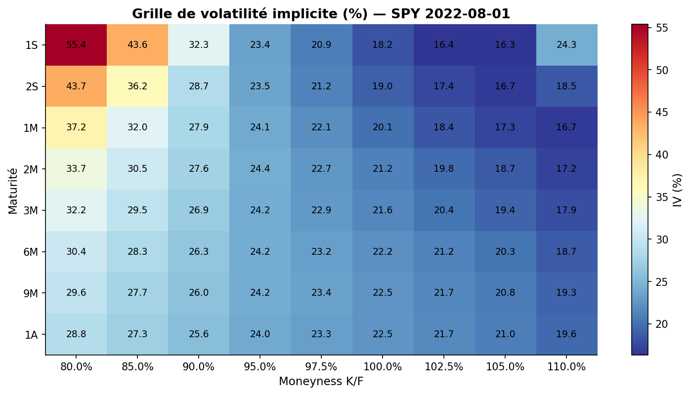 | 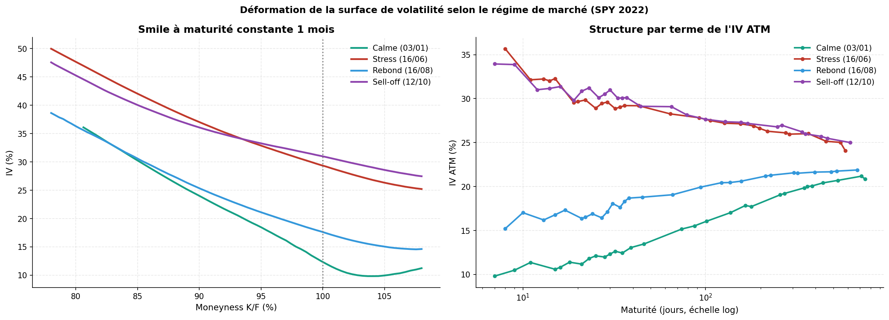 |

| Régime | Date | Spot | IV ATM 1M | IV ATM 6M | Structure par terme | Skew 1M (IV90 − IV100) |
|---|---|---|---|---|---|---|
| Calme | 03/01 | 477,8 | 12,3 % | 17,8 % | contango +5,5 pts | **11,7 pts** |
| Stress | 16/06 | 366,9 | 29,4 % | 26,9 % | backwardation −2,4 pts | 7,7 pts |
| Rebond | 16/08 | 429,7 | 17,6 % | 20,9 % | contango +3,3 pts | 7,7 pts |
| Sell-off | 12/10 | 356,6 | 31,0 % | 27,1 % | backwardation −3,9 pts | 5,1 pts |

### Level 3 — Volatilité stochastique : Heston (notebook 05)

La calibration porte sur 84 options OTM et 6 échéances (3 semaines à 1 an). La perte est une MSE en IV, minimisée par L-BFGS-B en multi-start. La validation se fait **hors échantillon** sur 652 options.

| Modèle | Paramètres | RMSE IV | Erreur max |
|---|---|---|---|
| Black-Scholes, vol unique | 1 | 5,81 pts | 19,8 pts |
| Black-Scholes, vol ATM par maturité | 6 | 7,16 pts | 25,1 pts |
| **Heston** | 5 | **0,88 pt** | 3,6 pts |

Paramètres calibrés (01/08/2022) : $\sqrt{v_0}$ = 20,6 %, κ = 9,36, $\sqrt\theta$ = 26,8 %, ξ = 2,12, ρ = −0,60. La **condition de Feller est violée** (2κθ = 1,35 < ξ² = 4,51) : la variance simulée touche 0 sur 21 % des pas.

**Deux bugs numériques corrigés en chemin**, qui faussaient la calibration :
1. **Troncature de l'intégrale de Fourier** : la borne fixe u ≤ 100 faisait osciller le prix Heston aux maturités courtes, jusqu'à 9 pts d'IV d'erreur dans l'aile. Ce bruit créait de **faux minima locaux** : deux points de départ donnaient des paramètres différents (RMSE 0,82 vs 1,39). Avec une borne adaptative issue de l'asymptotique de la fonction caractéristique, ils convergent vers la même solution.
2. **Perte discontinue** : les options dont l'IV modèle n'est pas inversible étaient retirées de la moyenne, ce qui bloquait L-BFGS-B (sell-off du 12/10). Correction : multi-start à 3 départs, avec repli sur Powell (sans gradient).

L'erreur résiduelle est concentrée sur le **court terme** (1,23 pt contre 0,50 à moyen terme) : un modèle de diffusion ne produit pas un skew assez pentu à quelques semaines.

**Calibration par régime** : `scripts/calibrate_regimes.py` recalibre Heston sur les 4 dates de régime (calme, stress, rebond, sell-off), avec la même procédure. Résultats dans `results/05_heston_params_by_regime.md`.

| Effet des paramètres sur le smile | Marché vs Heston |
|---|---|
| 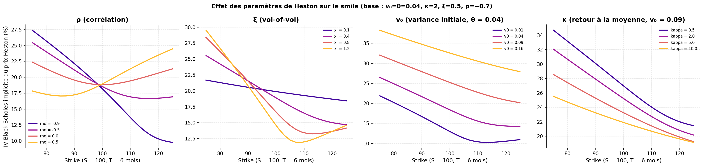 | 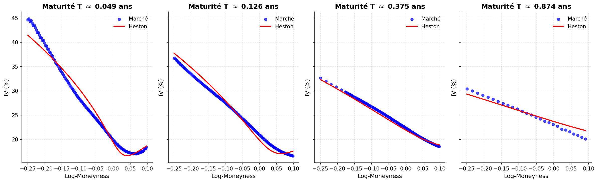 |

### Level 4 — Delta-hedging (notebook 06)

**Erreur de couverture.** Short call couvert quotidiennement : P&L centré sur 0, avec un écart-type de **0,435** contre 0,435 prédit par Kamal-Derman ($\sqrt{\pi/4}\,\text{Vega}\,\sigma/\sqrt N$).

**Fréquence de rebalancement vs frais** (call ATM 3 mois, trajectoires à 13 pas par jour) :

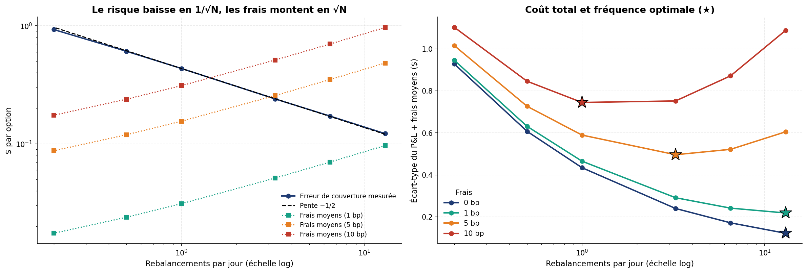

| Frais | Fréquence optimale | Écart-type + frais |
|---|---|---|
| 0 bp | 30 min | 0,12 |
| 1 bp | 30 min | 0,22 |
| 5 bp | 2 h | 0,50 |
| 10 bp | 1 fois par jour | 0,75 |

**Autres expériences**
- **Gamma** : l'erreur est maximale ATM. Rapporté à la prime, l'écart-type vaut 1 % en ITM, 18 % en ATM et **149 % en OTM**.
- **Erreur de vol** : le P&L moyen suit exactement C(σ_imp) − C(σ_réal). Par exemple, −3,97 $ simulé contre −3,89 $ théorique pour σ_réal = 30 % hedgé à 20 %.
- **Risque de modèle** : dans un monde Heston, la couverture Black-Scholes a un écart-type **4,8 fois plus élevé**, et un quantile à 1 % de −7,9 $ contre −1,2 $.
- **Stress** : krach de 20 % et +20 pts de vol = −7,8 $, soit **1,8 fois la prime** encaissée.

**Backtest réel SPY 2022** : chaque mois, vente d'un call ATM ~30 jours, delta-hedgé quotidiennement avec l'IV du jour.

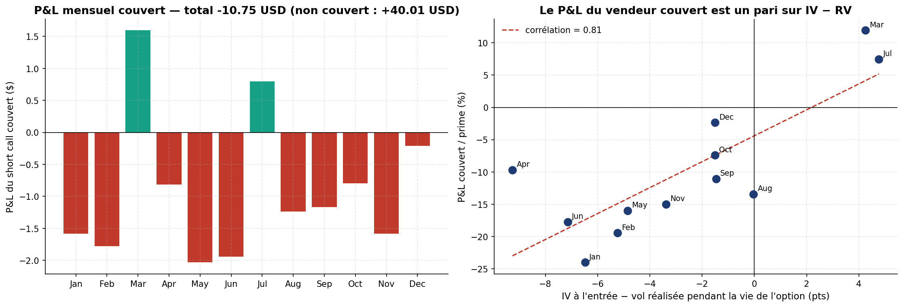

10 trades sur 12 perdent (−10,75 $ cumulés). Le P&L est corrélé à **0,81** avec (IV à l'entrée − vol réalisée), ce qui confirme empiriquement P&L ≈ ½∫ΓS²(σ²_imp − σ²_réal)dt. Le même short call **non couvert** gagne +40 $, mais uniquement parce que le marché a baissé.

### Extension — Prime de risque de volatilité et régimes (notebook 07)

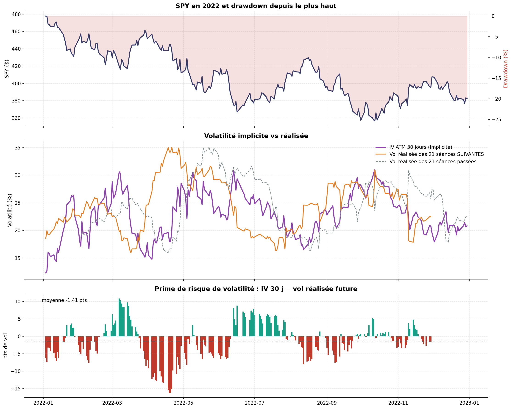

| | Valeur 2022 |
|---|---|
| IV ATM 30 j moyenne / vol réalisée future | 23,1 % / 24,5 % |
| VRP moyenne (IV − RV future) | **−1,4 pt** (IV > RV seulement 39 % des jours) |
| VRP en régime de vol basse / haute | **−5,1 pts** / +0,6 pt |
| Bêta spot-vol | −0,87 pt d'IV par +1 % de SPY (corrélation −0,81) |
| Corrélation avec la vol future : IV vs vol passée | 0,25 vs −0,02 |

2022 est une année atypique : la volatilité implicite a **sous-estimé** la volatilité réalisée, surtout après les périodes calmes. C'est l'inverse de la prime positive habituelle, et une année défavorable aux stratégies de vente de vol.

---

## Choix méthodologiques notables

- **Mid-price** plutôt que *last* : le dernier échange peut être périmé.
- **Options OTM uniquement** pour le smile et la calibration : les options ITM, peu liquides, bruitent le mid.
- **Forward implicite par parité call-put**, par échéance, plutôt qu'un dividende fixe.
- **Interpolation en variance totale** (σ²T linéaire en T) pour les points à maturité constante.
- **Perte de calibration en IV**, pas en prix, pour ne pas surpondérer les options chères.
- **Calibration multi-start** (3 départs), avec un pas de gradient numérique adapté à la précision du pricer et un repli sans gradient.
- **Borne d'intégration de Fourier adaptative** pour le pricer Heston (validée à 1e-7 $ contre une intégration de référence).
- **Couverture vectorisée** : même comptabilité que la version pas-à-pas (écart 0,0 testé), ~200× plus rapide.


## Installation et reproduction

```bash
git clone <url-du-repo> && cd options-pricing-volatility
pip install -r requirements.txt
python -m pytest -q tests                 # 396 tests, ~12 s
# données : voir data/README.md (placer spy_2022.csv dans data/)
bash scripts/run_all_notebooks.sh          # régénère figures/ et results/ (~30 min)
python scripts/calibrate_regimes.py        # calibration Heston par régime (~25 min)
```

Les notebooks sont versionnés **avec leurs sorties** : ils se lisent directement sur GitHub sans rien exécuter.

## Limites et extensions

- **Taux constant (r = 2 %)** alors que les taux US passent de ~0 % à ~4,3 % en 2022. Le forward implicite absorbe l'essentiel de l'effet, mais pas l'actualisation. Extension : courbe des T-bills.
- **Dividendes en rendement continu par échéance**, et non discrets.
- **Heston ne capture pas le skew court terme.** Extensions : Bates (sauts), rough Heston, SLV.
- **Frais proportionnels simples** : pas d'impact de marché ni de spread bid-ask sur le sous-jacent.
- **Couverture delta seule.** Extensions : couverture delta-vega avec une seconde option, deltas ajustés du smile, bandes de tolérance (Whalley-Wilmott).
- **Une seule année.** Tester la stratégie de vente de vol avec filtre de régime hors échantillon (2020-2021).

## Stack

Python · NumPy · pandas · SciPy (`optimize`, `integrate`, `stats`) · Matplotlib · pytest · Jupyter

